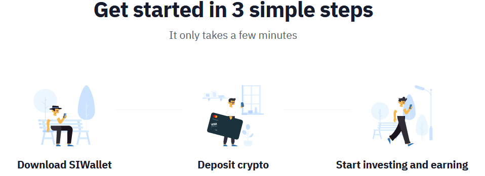

# SIWallet Requirements
---
## 1. Introduction
**SIWallet** - TypeScript-powered online project with crossplatform mobile app and server side, based on [React Native](https://reactnative.dev/docs/) and [NestJS](https://docs.nestjs.com/)
**Everything you need in one place:**
* Get & hold many different cryptocurrencies.
* Store stablecoins to avoid market volatility.
* Stay private & secure storing your privacy coins.
* Invest and increase your assets.

 

Store all your coins and tokens in a single, secure mobile wallet. The app suppports 100+ assets
Staking puts your assets to work, with interest rates ap to 40% APY

**Start earning in seconds**
Like you, we find the traditional process for earning interest long and frustrating. **Investings** makes earning easy.

## 2. User Requirements
#### 2.1. Software Interfaces
Optimize setup of DataBase using [Docker](https://www.docker.com/). Google Firebase services: Crushlytics, Analytics to collect data from the user, handle errors to improve the quality of the application. CoinMarketCap API to fetch all cryptocurrency data [CoinMarketCap](https://coinmarketcap.com/api/documentation).
#### 2.2. User Interfaces
You can check our design prototype at [Figma](https://www.figma.com/file/wMbUbB2b3GQln0crBhWyws/Crypto-Bot-Manager?node-id=0%3A1)
#### 2.3. User Characteristics
* **Default User** - user that use wallet to store his _GOLD_
* **Investor** - user that invest (start bots or invest in cryptocurrencies)

Due to simple user-friendly UI. No special skills required for work with our application. 
#### 2.4. Assumptions and Dependencies
* Limited time for realization

## 3. System Requirements
#### 3.1. Functional Requirements
##### 3.1.1 Bots List Page

This page contains a list of active bots and brief information about them, with the ability to get more detailed statistics, including average APY, DPY, exchange, and so on. In addition to this, a user has the ability to create a new trading bot with the specified amount of trading balance and one of four trading rates.

##### 3.1.2 Market Page

In the Market Page you can find a list of available cryptocurrencies and brief information about them. Moreover, the settings section makes it possible to configure displayed currencies. Furthermore, this page lists charts and brief statistics about the most popular trading pairs with the highest trading volumes.

##### 3.1.3 Discovery Page

All page of the Discovery Screen is saturated with various events and trends. User can explore all kind of news in cryptocurrency world and personalize notification settings for himeself.

##### 3.1.4 Profile Page

This page makes it possible to configure user profile information and view detailed statistics about trading balance, profit/loss, active bots, and so on. Besides, you can manage and view the statistic of your assets in the wallet section.

##### 3.1.6 SignIn/Register Pages
This pages allows you to login or register an account in the system.

##### 3.1.7 Wallet Page
This page shows general information about your wallet such as price changes, daily balance change, and all cryptocurrencies that you have. You can also send cryptocurrencies that you have to another wallet.

#### 3.2. Non-Functional Requirements
##### 3.2.1. Software Quality Attributes
* Unit tests. Those are needed for quality assurance and creating a fully functional system which users can successfully use. Will be measured by test coverage of the project.
* Open API for easy access to server functionality by client.
* User-Friendly UI for easier and enjoyable interaction with end users.
---
